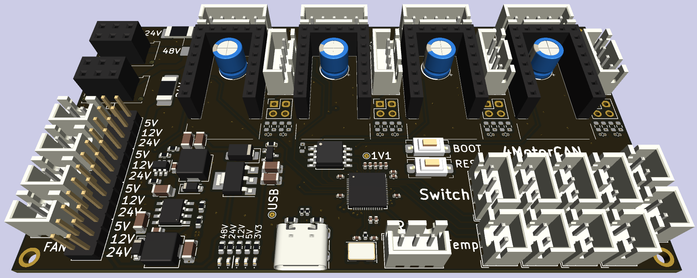

# 3D Printer 4-Motor Board (CAN-bus Device)

This is a hobby project to create 3D Printer board to allow either control of all 4 motors (XYZ + Extruder) or 4 motors per axis.

The brain is [RP2040](https://www.raspberrypi.com/products/rp2040/) (can be flashed using USB-C connector) and has [TMC5160](https://www.trinamic.com/products/integrated-circuits/details/tmc5160/) as its muscle.
All the power and commands are provided by [CAN bus](https://en.wikipedia.org/wiki/CAN_bus) [Molex Micro-Fit 3.0 connector](https://www.molex.com/en-us/products/connectors/wire-to-board-connectors/micro-fit-connectors).
If you do not want to use CAN bus, you must provide 24V and GND on the connector and connect USB-C to your controller.

I have tried putting as many notes into the schematic as possible.
Buck converters and LDOs have their voltage limits close to the input pins (those are recommended limits, not absolute ones).

*[Molex Micro-Fit 3.0](https://www.molex.com/en-us/products/connectors/wire-to-board-connectors/micro-fit-connectors) connectors are on the preview shown as 2x03 2.54mm/0.1" Pin Socket due to a missing 3D model.

## Features

- [CAN bus](https://en.wikipedia.org/wiki/CAN_bus) with power
  - 24V + 48V passthrough (48V optional, choose correct fuse orientation)
  - 5V signal
- 4x [TMC5160](https://www.trinamic.com/products/integrated-circuits/details/tmc5160/) to control motors (slotted PCB)
  - Encoder connector
  - Step LED (shows every step of the motor)
  - Optional direction switched (input, see TMC5160 documentation)
- 4x Limit Switch (endstop)
- RGB header (5V but signal is 3.3V)
- 4x 2pin Temperature sensor (resistor)
- 4x 2pin Fan control (5V / 12V / 24V) with 250mA fuse
- 2x Heating enable ("trigger", cannot power the heating)

### Warnings
- **This project was not yet tested. Use at your own risk.**
- This project uses RP2040 as if it was a 5V microcontroller.
  RP2040 is not officially 5V-tolerant but is reported by users to be able to process 5V input.
  And 3V output is 60% of 5V which should be enough for HIGH digital value of 5V devices.
- There is no overvoltage protection, do not turn axis motors too fast (manually)
  - Fan connectors have over-current protection (resettable fuse) in case of short circuit, but it will stop them from working
- Each motor has 3A max (total 12A) but [Molex Micro-Fit 3.0 connector](https://www.molex.com/en-us/products/connectors/wire-to-board-connectors/micro-fit-connectors) is rated only for 8.5A / 10.5A (depending on your source-of-truth) leaving only 2.125A / 2.625A per motor
    - This current limit is for the whole [CAN bus](https://en.wikipedia.org/wiki/CAN_bus)! The limit is least-rated connector in the network
    - [JST XH connectors](https://www.jst.com/products/crimp-style-connectors-wire-to-board-type/xh-connector/) should not esceed 3A.
- You should not power any heating through [CAN bus](https://en.wikipedia.org/wiki/CAN_bus) as power consumption can exceed safe limits for those connectors (and wires).

Keep in mind any current/temperature limits can be lower for higher-temperature environments (like fully boxed-in 3D printer).

## Limits and Power Consumption

| Component                | Expected Max Current | Max Temperature |
|--------------------------|----------------------|-----------------|
| RP2040 (microcontroller) | 50 mA                | 85 °C           |
| W25Q128JVS (flash)       | 4 mA                 | 85 °C (105 °C)  |
| TMC5160 (motor driver)   |                      | 125 °C          |
| Stepper motor            | 3A (x4)              |                 |

## Usage

Following usages are all theoretical based on hardware capabilities, none have been tested.

In case you do not want to use the 3mm pitch Molex connector for power, you can use the 3 pads in top-left corner to solder your wires directly to the PCB.
This is not recommended as it will usually skip fuse for motors (unless you use 24V for motors using `F103`).

### 3D Printer Board

This board can be used as a main 3D printer board as it has everything required for a basic printer (4 motors, limit switches, temperature sensors, heating triggers).

### CAN/USB Device

This device can be controlled using either [CAN bus](https://en.wikipedia.org/wiki/CAN_bus) or USB.
Having 4 motors and several input/output connectors, you can control most/all of the 3D printer from single CAN device.
In case of multiple motors per axis, you may need multiple devices (this board was primarily designed to control 4 Z-axis motors using single controller over CAN).

## Fabrication

DNP (Do Not Place/Populate) symbols are also removed from "Component Position" output.
The same applies to all connectors as those are not recommended/possible for automatic soldering.

You can save some money by replacing `R602`+`D601` by `R601` (and equivalent for `R701`,`R801` and `R901`) and omitting `R101`-`R105` and `D101`-`D105` (power indication LEDs).

### Problems

- No equivalent for `C201`/`C202` currently available
- No THT connectors in Component Placement files
  - 10x 2pin JST XH
  - 5x 3pin JST XH
  - 4x 4pin JST XH
  - 4x 5pin JST XH
  - 2x [Molex Micro-Fit 3.0 connector](https://www.molex.com/en-us/products/connectors/wire-to-board-connectors/micro-fit-connectors)
  - 2x12 2.54cm/0.1" Pin Header
  - 4x 4pin 2.54cm/0.1" Pin Header
  - 8x 8pin 2.54cm/0.1" Pin Header
